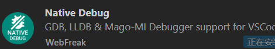
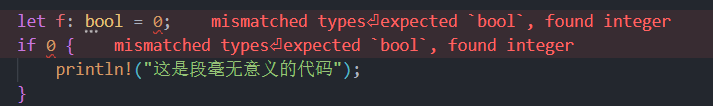

vscode+Rsut+\<[Rust语言圣经](https://course.rs/about-book.html))>+\<[Rust程序设计第二版](https://github.com/169LI/Rust_study/blob/main/%E3%80%8ARust%20%E7%A8%8B%E5%BA%8F%E8%AE%BE%E8%AE%A1%EF%BC%88%E7%AC%AC2%E7%89%88%EF%BC%89%E3%80%8B%E5%90%89%E5%A7%86%E2%80%A2%E5%B8%83%E5%85%B0%E8%BF%AA%E3%80%90%E6%96%87%E5%AD%97%E7%89%88_PDF%E7%94%B5%E5%AD%90%E4%B9%A6_%E9%9B%85%E4%B9%A6%E3%80%91.pdf)>+obsidian(笔记软件)+github(代码仓库)
# obsidian+github
# 搭建开发环境
&ensp;&ensp; &ensp;首先，需要安装最新版的 Rust 编译工具和 Visual Studio Code
Rust 编译工具：[安装 Rust ](https://www.rust-lang.org/zh-CN/tools/install)
Visual Studio Code：[Download Visual Studio Code - Mac, Linux, Windows](https://code.visualstudio.com/Download)

+ Rust 的编译工具依赖 C 语言的编译工具，这意味着你的电脑上至少已经存在一个 C 语言的编译环境。如果你使用的是 Linux 系统，往往已经具备了 GCC 或 clang。
+ 如果你使用的是 macOS，需要安装 Xcode。
+ 如果你是用的是 Windows 操作系统，你需要安装 Visual Studio 2013 或以上的环境（需要 C/C++ 支持）以使用 MSVC 或安装 MinGW + GCC 编译环境 

## 1 之前下载过vs2022 
&ensp;&ensp; &ensp;（没下过也不建议你下了     还不如开虚拟机用linux系统    或者用MinGW   vs2022有点大）


## 2 rust 编译工具
&ensp;  &ensp;官方下载地址: [rust](https://www.rust-lang.org/learn/get-started)  选择64bit，下载后的文件名为rustup-init.exe


## 3 运行rustup-init.exe


&ensp;&ensp; &ensp;上图显示的是一个命令行安装向导。

&ensp;&ensp; &ensp;如果你已经安装 MSVC （推荐），那么安装过程会非常的简单，输入 1 并回车，直接进入第二步。


&ensp;&ensp; &ensp;没有安装MSVC或者后续准备使用GNU得处理方法（ 后面可能会使用GNU,可能还得弄）

&ensp;&ensp; &ensp;如果你安装的是 MinGW，那么你需要输入 2 （自定义安装），然后系统会询问你 Default host triple? 请将上图中 default host triple 的 "msvc" 改为 "gnu" 再输入安装程序。


&ensp;&ensp; &ensp;设置完所有选项，会回到安装向导界面（第一张图），这是我们输入 1 并回车即可。
## 4 测试

`rustc -V        # 注意的大写的 V`


&ensp;&ensp; &ensp;环境成功配置

## 5 Visual Studio Code 开发环境
&ensp; analyzer 和 Native Debug 两个扩展   之后重启  选择一个新的文件夹




 选择菜单栏中的"终端"-"新建终端"，会打开一个新的终端并输入命令：
```
 创建新项目：cargo new <项目名>

 构建项目：cargo build

 运行项目：cargo run

 测试项目：cargo test
```

cargo new greeting  会自动构建一个名叫 greeting 的 Rust 工程目录。现在在终端里输入以下三个命令：
```
cd ./greeting
cargo build
cargo run
```

成功的构建了一个 Rust 命令行程序！
## 6 调试（debug）
&ensp;&ensp; &ensp;自带的那个是真不好用     自己配的这个也没好到哪里！  Rust后面会调试应该可能可以学快点，我也不清楚（学c++不会调试直接凉一半）


&ensp;&ensp; &ensp;直接粘贴下面的内容就ok了

```
{

    //调试哪一个就复制到哪一个文件夹下
    
    // 使用 IntelliSense 了解相关属性。
    // 悬停以查看现有属性的描述。
    // 欲了解更多信息，请访问: https://go.microsoft.com/fwlink/?linkid=830387
    "version": "0.2.0",
    "configurations": [
        {
            "name": "(Windows) 启动",
            "type": "cppvsdbg",
            "request": "launch",
            "program": "${workspaceFolder}/target/debug/${workspaceFolderBasename}.exe",
            "args": [],
            "stopAtEntry": false,
            "cwd": "${fileDirname}",
            "environment": [],
            "console": "internalConsole"
        }
    ]
}
```
## 7 卸载
&ensp;&ensp; &ensp;要卸载 Rust 和 rustup，在终端执行以下命令即可卸载：

&ensp;&ensp; &ensp;`rustup self uninstall（建议不要试）`

## 8 本地文档

&ensp;&ensp; &ensp;安装 Rust 的同时也会在本地安装一个文档服务，方便我们离线阅读：运行下面命令
```
 rustup doc
 cargo doc --help
```
&ensp;&ensp; &ensp; 用浏览器打开本地文档即可查看

&ensp;&ensp; &ensp;编程语言的学习尽头从不是书籍和视频教学中获取的知识而是能看懂懂官方文档的能力

## 9  .gitignore文件
 &ensp;&ensp; &ensp;如果有上传github需求  建议加一个.gitignore文件  把不想上传的文件写进去。他的target文件夹（编译的文件都在里面放）一运行就显示红色提示我上传   真的很烦。
```
target
.gitignore
```
# 一. 数据类型
&ensp;&ensp; &ensp;本章从简单的数值类型（如整数和浮点值）开始，后面转而介绍包含更多数据的类型：Box、元组（tuple）、数组和字符串。

>&ensp;&ensp; &ensp;**固定数值类型（整型+浮点型）**
 >
 &ensp;&ensp; &ensp;Rust 中数值类型的名称都遵循着一种统一的模式，类型定义的形式统一为：有无符号 + 类型大小(位数)。

 机器字是一个值，其大小等于运行此代码的机器上“地址”的大小，可能是 32 位，也可能是 64 位。
默认情况下，12.0 将表示 64 位浮点数 12表示有符号32位整数。
`let x = -10.abs(); // 错误`
方法调用的优先级高于前缀运算符，因此在对负值进行方法调用时，请务必正确地加上圆括号。

<font color="#2DC26B">进入正题：开始Rust!!!</font>

## 1.1 整型（Integer）
&ensp;&ensp; &ensp;整数型简称整型，按照比特位长度和有无符号分为以下种类

&ensp;&ensp; &ensp;为了让长数值更易读，可以在数字之间任意插入下划线。
  
### 1.1.1 整型溢出
&ensp;&ensp; &ensp;假设有一个 u8 ，它可以存放从 0 到 255 的值。那么当你将其修改为范围之外的值，比如 256，则会发生整型溢出。

&ensp;&ensp; &ensp;Rust 会检查整型溢出，若存在这些问题，则使程序在编译时 panic(崩溃,Rust 使用这个术语来表明程序因错误而退出)。在当使用release 参数进行 release 模式构建时，Rust 不检测溢出。相反，当检测到整型溢出时，Rust 会按照补码**循环溢出**（two’s complement wrapping）的规则处理。程序不会 panic，但是该变量的值可能不是你期望的值。依赖这种默认行为的代码都应该被认为是错误的代码。
### 1.1.2 溢出的处理
&ensp;&ensp; &ensp;要显式处理可能的溢出，可以使用标准库针对原始数字类型提供的这些方法，以下是常用的几个:
1. 加法
-  wrapping_add: 循环加法。
- checked_add: 溢出时返回 None。
- overflowing_add: 返回结果和溢出指示布尔值。
- saturating_add: 超过最大值时返回最大值。

```
   fn main() {
    // 加法 (Addition)
    println!("加法示例:");

    let wrapping_add_result = u8::MAX.wrapping_add(1);
    println!("wrapping_add: {}", wrapping_add_result); // 结果是 0

    let checked_add_result = u8::MAX.checked_add(1);
    println!("checked_add: {:?}", checked_add_result); // 返回 None

    let (overflowing_add_result, overflowing_add_overflowed) = u8::MAX.overflowing_add(1);
    println!("overflowing_add: result = {}, overflowed = {}", overflowing_add_result, overflowing_add_overflowed); // result = 0, overflowed = true

    let saturating_add_result = u8::MAX.saturating_add(1);
    println!("saturating_add: {}", saturating_add_result); // 结果是 255
    }
```
2. 减法
- wrapping_mul: 循环乘法。
- checked_mul: 如果发生溢出返回 None。
- overflowing_mul: 返回计算结果和是否溢出的布尔值。
- saturating_mul: 结果不会超过最大值。
```
fn main(){
 // 减法 (Subtraction)
    println!("\n减法示例:");

    let wrapping_sub_result = u8::MIN.wrapping_sub(1);
    println!("wrapping_sub: {}", wrapping_sub_result); // 结果是 255

    let checked_sub_result = u8::MIN.checked_sub(1);
    println!("checked_sub: {:?}", checked_sub_result); // 返回 None

    let (overflowing_sub_result, overflowing_sub_overflowed) = u8::MIN.overflowing_sub(1);
    println!("overflowing_sub: result = {}, overflowed = {}", overflowing_sub_result, overflowing_sub_overflowed); // result = 255, overflowed = true

    let saturating_sub_result = u8::MIN.saturating_sub(1);
    println!("saturating_sub: {}", saturating_sub_result); // 结果是 0
}
```

3. 乘法
- wrapping_mul: 循环乘法。
- checked_mul: 如果发生溢出返回 None。
- overflowing_mul: 返回计算结果和是否溢出的布尔值。
- saturating_mul: 结果不会超过最大值。
```
fn main(){
// 乘法 (Multiplication)
    println!("\n乘法示例:");

    let wrapping_mul_result = u8::MAX.wrapping_mul(2);
    println!("wrapping_mul: {}", wrapping_mul_result); // 结果是 254

    let checked_mul_result = u8::MAX.checked_mul(2);
    println!("checked_mul: {:?}", checked_mul_result); // 返回 None

    let (overflowing_mul_result, overflowing_mul_overflowed) = u8::MAX.overflowing_mul(2);
    println!("overflowing_mul: result = {}, overflowed = {}", overflowing_mul_result, overflowing_mul_overflowed); // result = 254, overflowed = true

    let saturating_mul_result = u8::MAX.saturating_mul(2);
    println!("saturating_mul: {}", saturating_mul_result); // 结果是 255
}
```

&ensp;&ensp;&ensp;每种运算都有不同的处理方式，可以根据具体需求选择适合的方法来处理溢出和边界情况.

&ensp;&ensp;&ensp;还有除法 、移位置等操作的溢出判断，这里不在演示。不过大家可以来看一下原文档里面是怎末说的(除法为例)：


|      |      |                                       |
| ---- | ---- | ------------------------------------- |
| 运算   | 名称后缀 | 例子                                    |
| 加法   | add  | 100_i8.checked_add(27) == Some(127)   |
| 减法   | sub  | 10_u8.checked_sub(11) == None         |
| 乘法   | mul  | 128_u8.saturating_mul(3) == 255       |
| 除法   | div  | 64_u16.wrapping_div(8) == 8           |
| 求余   | rem  | (-32768_i16).wrapping_rem(-1) == 0    |
| 取负   | neg  | (-128_i8).checked_neg() == None       |
| 绝对值  | abs  | (-32768_i16).wrapping_abs() == -32768 |
| 求幂   | pow  | 3_u8.checked_pow(4) == Some(81)       |
| 按位左移 | shl  | 10_u32.wrapping_shl(34) == 40         |
| 按位右移 | shr  | 40_u64.wrapping_shr(66) == 10         |

### 1.1.3 数字运算

上面提到了基本运算下面简单的来介绍一下数字运算。Rust 支持所有数字类型的基本数学运算：加法、减法、乘法、除法和求余运算。
```
fn main() {
    // 加法
    let sum = 5 + 10;
    // 减法
    let difference = 95.5 - 4.3;
    // 乘法
    let product = 4 * 30;
    // 除法
    let quotient = 56.7 / 32.2;
    // 求余
    let remainder = 43 % 5;       
}
```
许多运算符号之后加上 = 号是自运算的意思，例如：sum += 1 等同于 sum = sum + 1。（涉及**所有权问题需注意**）<span style="color:red">（代码补充）</span>

**注意**：Rust **不支持 ++ 和 --**，因为这两个运算符出现在变量的前后会影响代码可读性，减弱了开发者对变量改变的意识能力。

### 1.1.4 位运算
Rust 的位运算基本上和其他语言一样。

|                   |                              |
| ----------------- | ---------------------------- |
| 运算符               | 说明                           |
| & 位与 （注意与& 引用相区分） | 相同位置均为1时则为1，否则为0             |
| \| 位或             | 相同位置只要有1时则为1，否则为0            |
| ^ 异或              | 相同位置不相同则为1，相同则为0             |
| ! 位非              | 把位中的0和1相互取反，即0置为1，1置为0       |
| << 左移             | 所有位向左移动指定位数，右位补0             |
| >> 右移             | 所有位向右移动指定位数，带符号移动（正数补0，负数补1） |
```
fn main() {
	// 无符号8位整数，二进制为00000010
	let a: u8 = 2; // 也可以写 let a: u8 = 0b_0000_0010;// 二进制为00000011
	let b: u8 = 3;
	// {:08b}：左高右低输出二进制01，不足8位则高位补0
	println!("a value is        {:08b}", a);
	println!("b value is        {:08b}", b);
	println!("(a & b) value is  {:08b}", a & b);
	println!("(a | b) value is  {:08b}", a | b);
	println!("(a ^ b) value is  {:08b}", a ^ b);
	println!("(!b) value is     {:08b}", !b);
	println!("(a << b) value is {:08b}", a << b);
	println!("(a >> b) value is {:08b}", a >> b);
	let mut a = a;
	// 注意这些计算符除了!之外都可以加上=进行赋值 (因为!=要用来判断不等于)
	a <<= b;
	println!("(a << b) value is {:08b}", a);
}
```

## 1.2 浮点数型（Floating-Point）

Rust 提供了 IEEE 单精度浮点类型和 IEEE 双精度浮点类型。这些类型包括**正无穷大和负无穷大、不同的正零值和负零值，以及非数值**。

浮点类型数字是**带有小数点**的数字，在 Rust 中浮点类型数字也有两种基本类型： f32 和 f64，分别为 32 位和 64 位大小。**默认浮点类型是 f64**，在现代的 CPU 中它的速度与 f32 几乎相同，但精度更高。

```
fn main() {
    // f32 类型的特殊值
    let f32_infinity = f32::INFINITY;           // 正无穷大
    let f32_neg_infinity = f32::NEG_INFINITY;   // 负无穷大
    let f32_nan = f32::NAN;                      // 非数值
    let f32_min = f32::MIN;                      // 最小有限值
    let f32_max = f32::MAX;                      // 最大有限值
    println!("f32: INFINITY = {}, NEG_INFINITY = {}, NAN = {}, MIN = {}, MAX = {}", f32_infinity, f32_neg_infinity, f32_nan, f32_min, f32_max);
    // f64 类型的特殊值
    let f64_infinity = f64::INFINITY;           // 正无穷大
    let f64_neg_infinity = f64::NEG_INFINITY;   // 负无穷大
    let f64_nan = f64::NAN;                      // 非数值
    let f64_min = f64::MIN;                      // 最小有限值
    let f64_max = f64::MAX;                      // 最大有限值
    println!("f64: INFINITY = {}, NEG_INFINITY = {}, NAN = {}, MIN = {}, MAX = {}",f64_infinity, f64_neg_infinity, f64_nan, f64_min, f64_max);
}
```

### 1.2.1 NaN

对于**数学上未定义**的结果，例如对负数取平方根会产生一个特殊的结果：Rust 的浮点数类型使用 NaN (not a number) 来处理这些情况.出于防御性编程的考虑，可以使用 is_nan() 等方法，可以用来判断一个数值是否是 NaN ：

```
fn main() {
    let x = (-42.0_f32).sqrt();
    if x.is_nan() {
        println!("未定义的数学行为")
    }
}
```

### 1.2.2 浮点数陷阱

1. 浮点数往往是你想要数字的近似表达
浮点数类型是基于二进制实现的，学过计组应该知道这里的问题了。例如 0.1 在二进制上并不存在精确的表达形式，但是在十进制上就存在。

2. 浮点数在某些特性上是反直觉的

例如大家都会觉得浮点数可以进行比较，对吧？

是的，它们确实可以使用 >，>= 等进行比较，f32 ， f64 上的比较运算实现的是std::cmp::PartialEq 特征，但是并没有实现 std::cmp::Eq 特征。

为了避免上面说的两个陷阱，你需要**遵守以下准则**：

- 避免在浮点数上测试相等性;
- 当结果在数学上可能存在未定义时，需要格外的小心。
```
fn main() {
    let abc: (f32, f32, f32) = (0.1, 0.2, 0.3);
    let xyz: (f64, f64, f64) = (0.1, 0.2, 0.3);

    println!("abc (f32)");
    println!("   0.1 + 0.2: {:x}", (abc.0 + abc.1).to_bits());
    println!("         0.3: {:x}", (abc.2).to_bits());
    println!();

    println!("xyz (f64)");
    println!("   0.1 + 0.2: {:x}", (xyz.0 + xyz.1).to_bits());
    println!("         0.3: {:x}", (xyz.2).to_bits());
    println!();

    assert!(abc.0 + abc.1 == abc.2);
    assert!(xyz.0 + xyz.1 == xyz.2);
}
```

对 f32 类型做加法时，0.1 + 0.2 的结果是 3e99999a，0.3 也是 3e99999a，因此 f32 下的 0.1 + 0.2 == 0.3 通过测试。

f64 类型时，结果就不一样了，因为 f64 精度高很多，因此在小数点非常后面发生了一点微小的变化，0.1 + 0.2 以 4 结尾，但是 0.3 以3结尾，这个细微区别导致 f64 下的测试失败了，并且抛出了异常。

### 1.2.3 As 完成类型转换
**Rust 几乎不会执行任何隐式的数值转换**。如果函数需要 f64参数，则传入 i32 型参数是错误的。事实上，Rust 甚至不会隐式地将 i16 值转换为 i32 值，虽然每个 i16 值都必然在 i32 范围内。

不过，你随时可以用 as 运算符写出显式转换：i as f64 或 x as i32。隐式整数转换有着导致错误和安全漏洞的大量“前科”，特别是在用这种整数表示内存中某些内容的大小时，很可能发生意外溢出。根据以往的经验，Rust 这种要求明确写出数值类型转换的行为，会提醒我们注意到一些可能错过的问题。
```
// 显式转换
fn main() {
    let int_value: i32 = 42;
    let float_value: f64 = 3.14;
    let small_int: i16 = 100;
    let converted_to_float: f64 = int_value as f64; // 将 i32 转换为 f64
    let converted_to_int: i32 = small_int as i32;   // 将 i16 转换为 i32

    println!("int_value as f64: {}", converted_to_float);
    println!("small_int as i32: {}", converted_to_int);

    // 直接传递类型不匹配的参数会导致编译错误
    // let result = add_float(int_value); // 这行代码会导致错误

    // 正确的调用方式，使用显式转换
    let result = add_float(int_value as f64);
    println!("Result of adding float: {}", result);
}
// 函数需要 f64 类型参数
fn add_float(value: f64) -> f64 {
    value + 1.0 // 进行简单的加法
}
```

Rust 中可以使用 As 来完成一个类型到另一个类型的转换，其最常用于将原始类型转换为其他原始类型，但是它也可以完成诸如将指针转换为地址、地址转换为指针以及将指针转换为其他指针等功能。<span style="color:red">（需要添加后续笔记链接）</span>
## 1.3 布尔类型(bool)

Rust 中的布尔类型值**只能**是：true 和 false，布尔值占用内存的大小为 1 个字节。

这个地方和C++语言有点不一样的地方： true能写成1,false能写成0吗？事实说话。


```
fn main() { 
	let t = true; 
	let f: bool = false; 
	// 使用类型标注,显式指定f的类型 if f { println!("这是段毫无意义的代码"); } }
```

使用布尔类型的场景**主要在于流程控制**，例如上述代码的中的 if 就是其中之一。

Rust 的 **as 运算符可以将 bool 值转换为整型：**

```
fn main(){
    assert_eq!(false as i32, 0);
    assert_eq!(true  as i32, 1);
}
```

但是，as **无法进行另一个方向（从数值类型到 bool）的转换**。相反，你必须显式地写出比较表达式。

## 1.4 字符类型(char)

Rust 的字符不仅仅是 ASCII，**所有的 Unicode 值都可以作为 Rust 字符**，包括单个的中文、日文、韩文、emoji 表情符号等等，都是合法的字符类型。

Unicode 值的范围从 U+0000 到 U+D7FF 和 U+E000 到 U+10FFFF （包括两端），char 永远不会是“半代用区”中的码点（0xD800 到 0xDFFF 范围内的码点， 它们不能单独使用）。

一般推荐使用字符串储存 UTF-8 文字（非英文字符尽可能地出现在字符串中）。在 Rust 中字符串和字符都必须使用 UTF-8 编码，否则编译器会报错。

字符的Unicode码点在 U+0000 到 U+007F 范围内（也就是说，如果它是从 ASCII 字 符集中提取的），就可以把字符写为 '\xHH'，其中 HH 是两个十六进制数。例 如，字符字面量 '*' 和 '\x2A' 是等效的。
（真写不下去了 后面关于Unicode码点的我是真看不懂 ！！！这个地方应该是不是学习重点）
```
fn main() {
    let c = 'z';
    let z = 'ℤ';
    let g = '国';
    let heart_eyed_cat = '😻';
}
```

由于 Unicode 都是 4 个字节编码，因此**字符类型也是占用 4 个字节**。

**切记Rust 的字符只能用 '  ' 来表示， " " 是留给字符串的。**

## 1.5 元组(Tuple)

元组是各种类型值的值对或三元组、四元组、五元组等（因此称为 n-元组或元 组）。

其实你可以把数组[ ]和元组叫做**复合类型**。因为可以包含不同种类的数据(这句话有毛病可以忽略)。但他俩还是有点不同的。

+ 定义：() 表示一个元组，可以包含多个不同类型的值。
	- 用法：
		* 元组可以用来组合不同类型的值。
		* 元组的长度是固定的，且长度在编译时已知。
	- 示例：	
	```
	fn main(){
		let tuple: (i32, f64, char) = (42, 3.14, 'a');  //不同类型是这个意思
		println!("Tuple values: {:?}", tuple);
	}
	```
+ 和数组[ ]做一个简单对比 后面有对数组的详细介绍[[#1.7 数组  |数组]]
    - 类型：
		* 元组可以包含不同类型的元素； 
		* 数组只能包含相同类型的元素。
     - 长度：
	     * 元组的长度是固定的，但长度可以是不同的（不同的元组可以有不同数量的元素）；
	     * 数组的长度在定义时确定，并且所有数组的长度都是相同的。
+ 访问方式：
	- 元组可以通过位置来访问元素， tuple.0、tuple.1。
	- 数组可以通过索引来访问， array[0]。 
	- 
```
	fn  main(){
		let text = "I see the eigenvalue in thine eye";
		let temp = text.split_at(21);
		let head = temp.0;
		let tail = temp.1;
		assert_eq!(head, "I see the eigenvalue ");
		assert_eq!(tail, "in thine eye");
	}
```
还有一个常用的元组类型是**零元组 ()**。传统上，这叫作单元类型，因为此类型只有 一个值，写作 ( )。

当无法携带任何有意义的值但其上下文仍然要求传入某种类型时， Rust 就会使用单元类型。main 函数就返回这个单元类型 ()，你不能说 main 函数无返回值，因为没有返回值的函数在 Rust 中是有单独的定义的：**发散函数**( diverge function )，顾名思义，无法收敛的函数。

例如，不返回值的函数的返回类型为 ()。常见的 println!() 的返回值就是单元类型 ()。

Rust 始终允许在所有能用逗号的地方（函数参数、 数组、结构体和枚举定义，等等）添加额外的尾随逗号。 为了保持一致性，甚至有包含单个值的元组。字面量 ("lonely hearts",) 就 是一个包含单个字符串的元组，它的类型是 (&str,)。在这里，**值后面的逗号是必需 的，以用于区分单值元组和简单的括号表达式。**

### 1.5.1 用模式匹配解构元组

```
fn main() {
    let tup = (500, 6.4, 1);
    let (x, y, z) = tup;
    println!("The value of y is: {}", y);
}
```

使用 let (x, y, z) = tup; 来完成一次模式匹配，因为元组是 (n1, n2, n3) 形式的，因此我们用一模一样的 (x, y, z) 形式来进行匹配，元组中对应的值会绑定到变量 x， y， z上。这就是**解构：用同样的形式把一个复杂对象中的值匹配出来。**

### 1.5.2 用 . 来访问元组

Rust 提供了 **. 的访问方式**：和其它语言的数组、字符串一样，元组的索引从 0 开始。

```
fn main() {
    let x: (i32, f64, u8) = (500, 6.4, 1);
    let five_hundred = x.0;
    let six_point_four = x.1;
    let one = x.2;
}
```

`let hello = String::from("Hola");` 
对这行代码来说，Hola 的长度是 4 个字节，因为 "Hola" 中的每个字母在 UTF-8 编码中仅占用 1 个字节。

### 1.5.3 元组的使用示例

元组在函数返回值场景很常用，例如下面的代码，可以使用元组返回多个值：
```
fn main() {
    let s1 = String::from("hello");
    let (s2, len) = calculate_length(s1);
    println!("The length of '{}' is {}.", s2, len);
}
fn calculate_length(s: String) -> (String, usize) {
    let length = s.len(); // len() 返回字符串的长度
    (s, length)
}
```

calculate_length 函数接收 s1 字符串的所有权，然后计算字符串的长度，接着把字符串所有权和字符串长度再返回给 s2 和 len 变量。

## 1.6 指针类型

Rust 有多种表示内存地址的类型，接下来将讨论 3 种指针类型：引用、Box 和不安全指针。

### 1.6.1 引用

最简单的方式是将引用视为 Rust 中的基本指针类型.
<span style="color:red">（此处简单介绍  需要补充后续详细章节链接）</span>
对 i32 的引用是一个保存着 i32 地址的机器字，这个地址可能位于栈或堆中。表达式 &x 会生成 一个对 x 的引用，在 Rust 术语中，我们会说它借用了对 x 的引用。给定一个引用 r，表达式 *r 会引用 r 指向的值。

Rust 引用有两种形式：
+ &T	
 一个不可变的共享引用。你可以同时拥有多个对给定值的共享引用，但它们是只读的：禁止修改它们所指向的值，就像 C 中的 const T* 一样。
```
fn main() {
//用 s1 的引用作为参数传递给 calculate_length 函数，而不是把 s1 的所有权转移给该函数
    let s1 = String::from("hello");
    let len = calculate_length(&s1);      
    println!("The length of '{}' is {}.", s1, len);
}
fn calculate_length(s: &String) -> usize {
    s.len()
}
```
+ &mut T
一个可变的、独占的引用。你可以读取和修改它指向的值，就像 C 中的 T* 一样。但是只要该引用还存在，就不能对该值有任何类型的其他引用。事实上，访问该值的唯一途径就是使用这个可变引用。

Rust 利用共享引用和可变引用之间的“**二选一**”机制（只有一个可变引用或者多个不可变引用）来强制执行“**单个写入者或多个读取者**”规则：或者独占写一个值，或者让任意数量的读取者共享，但二者只能选择其一。这种限制的好处就是使 Rust 在编译期就避免数据竞争，数据竞争可由以下行为造成：
- 两个或更多的指针同时访问同一数据
- 至少有一个指针被用来写入数据
- 没有同步数据访问的机制

```
fn main() {
//用 s1 的引用作为参数传递给 calculate_length 函数，而不是把 s1 的所有权转移给该函数
    let s1 = String::from("hello");
    let len = calculate_length(&s1);      
    println!("The length of '{}' is {}.", s1, len);
}
fn calculate_length(s: &String) -> usize {
    s.len()
}
```

来吧见识一下NLL吧！！（Rust 1.31 后引入）

对于这种编译器优化行为，Rust 专门起了一个名字 —— Non-Lexical Lifetimes(NLL)，专门用于找到某个引用在作用域(})结束前就不再被使用的代码位置。（Rust编译器,天才第一步）

```
fn main() {
   let mut s = String::from("hello");
    let r1 = &s;
    let r2 = &s;
    //let r3 = &mut s;  //这里会报错
    println!("{} and {}", r1, r2);
    // 新编译器中，r1,r2作用域在这里结束
    let r3 = &mut s;
    //let r4 = &s;      //这里会报错
    println!("{}", r3);
} // 老编译器中，r1、r2、r3作用域在这里结束
// 新编译器中，r3作用域在这里结束
```

### 1.6.2 Box

在堆中分配值的最简单方式是使用 Box::new。（这里**需要对内存的栈和堆有一个认识**，后面学习依旧要用到，这里不在做笔记）Box 是一个智能指针，它在堆上分配内存并提供对该内存的安全访问。使用 Box 可以在运行时动态分配内存，并且可以存储大小在编译时未知的类型。
```
fn main() {
    // 在堆上分配一个 i32 值
    let boxed_value = Box::new(42);
    // 访问堆上的值
    println!("The value in the box is: {}", boxed_value);
    // 通过解引用访问原始值
    let value = *boxed_value;
    println!("The unboxed value is: {}", value);
}

```
<span style="color:red">（在所有权和移动时再详细深入介绍Box 等待补充链接）</span>

### 1.6.3 不安全指针(裸指针)

Rust 也有裸指针类型 *mut T 和 *const T。裸指针实际上和 C++ 中的指针很像。使用裸指针是不安全的，因为Rust 不会跟踪它指向的内容。例如，裸指针可能为空，或者它们可能指向已释放的内存或现在包含不同类型的值。C++ 的所有经典指针错误都可能“借尸还魂”。

你只能在 unsafe 块中对裸指针解引用（dereference）。unsafe 块是Rust 高级语言特性中的可选机制，其安全性取决于你自己。如果代码中没有 unsafe块（或者虽然有但编写正确），那么本书中强调的安全保证就仍然有效。
<span style="color:red">（需要进一步的代码补充 后面遇到会补充）</span>

## 1.7 数组
### 1.7.1 数组的基本声明

在 Rust 中，数组的声明形式如下：
`let lazy_caterer: [u32; 6] = [1, 2, 4, 7, 11, 16]; // 声明一个固定长度的数组`
- \[u32; 6] 说明这是一个长度为 6 的数组，元素类型是 u32类型。
- **数组是固定大小**的，在编译时长度就已经确定。

您还可以在数组中放入多个值：

```
fn main(){
	let taxonomy = ["Animalia", "Arthropoda", "Insecta"];  // 声明一个字符串数组
	assert_eq!(taxonomy.len(), 3);  // 数组长度是 3
	assert_eq!(taxonomy[1], "Arthropoda");  
}
// 索引从 0 开始，第二个元素是 "Arthropoda"
```

1.7.2 使用 \[V; N] 语法创建固定大小的数组

Rust 允许使用 \[V; N] 的语法来创建一个元素都为 V 且长度为 N 的数组。

```
fn main(){
let mut sieve = [true; 10000];  // 创建一个长度为 10000 的数组，所有值为 true
for i in 2..100 {
    if sieve[i] {
        let mut j = i * i;
        while j < 10000 {
            sieve[j] = false;  // 标记非质数
            j += i;
        }
    }
}
assert!(sieve[211]);  // 211 是质数
assert!(!sieve[9876]);  // 9876 不是质数
}
```
这里：
- 使用 \[true; 10000] 创建一个布尔值数组，所有值初始化为 true。
- 该算法是著名的埃拉托斯特尼筛法，用于筛选质数。

### 1.7.3 数组和切片

数组的一个重要特性是它可以作为切片来使用。切片是对数组（或向量）的引用，提供了一种更加灵活的访问方式，且切片的长度是可以变化的。

Rust 中的数组方法大多是通过切片来实现的，常见的切片方法包括 sort、iter、len 等。

```
fn main(){
	let mut chaos = [3, 5, 4, 1, 2];
	chaos.sort();  // 排序
	assert_eq!(chaos, [1, 2, 3, 4, 5]);  // 排序后的数组是 [1, 2, 3, 4, 5]
}
```

这里：

- sort 方法是定义在切片上的，但它可以通过数组的引用来隐式地调用。
- Rust 会自动将数组 chaos 转换为 &mut [i32] 类型的切片引用，然后再调用 sort 方法。

### 1.7.4 数组的不可变和可变借用

数组是栈上的固定大小的集合，您可以借用它们，但必须遵守不可变或可变借用规则：

- 不可变借用：允许您以只读方式访问数组中的元素。
- 可变借用：允许修改数组中的元素。

例如：
```
fn main(){
	let mut nums = [1, 2, 3];
	let nums_ref = &mut nums;  // 可变借用
	nums_ref[0] = 42;  // 修改 nums 的第一个元素
}
```

### 1.7.5 数组的大小是固定的

Rust 的数组长度在编译时是固定的，因此不能在运行时动态改变数组的大小。

```
fn main(){
	let n = 5;
	let arr = [0; n];  // 错误：`n` 需要是常量
}
```

为了处理大小动态的数组，Rust 提供了**向量（Vec）类型，它在运行时可以动态增长或缩小。**

### 1.7.6 数组的不可变和可变引用的例子

```
fn main() {
    let mut arr = [1, 2, 3];
    // 不可变借用
    let ref1 = &arr;  
    println!("ref1: {:?}", ref1);  // 引用数组，输出：[1, 2, 3]
    // 可变借用
    let ref2 = &mut arr;  
    ref2[0] = 42;  // 修改数组
    println!("ref2: {:?}", ref2);  // 引用修改后的数组，输出：[42, 2, 3]
    // 再次使用不可变借用
    let ref3 = &arr;
    println!("ref3: {:?}", ref3);  // 引用修改后的数组，输出：[42, 2, 3]
}
```

### 1.7.7 总结

- 固定大小：数组的大小在编译时确定，因此无法动态更改长度。
- 切片：数组可以作为切片使用，切片方法与数组操作非常相似，数组本身被隐式转换为切片。
- 不可变和可变引用：Rust 中的数组遵循严格的所有权和借用规则，可通过借用来访问和修改数组的元素。
- 初始化方法：使用 \[value; length] 可以初始化固定大小的数组，所有元素值都相同。
## 1.8 向量

在 Rust 中，Vec 是一种非常重要的集合类型，代表一个可以动态增长和缩小的向量。它提供了一个灵活、可调整大小的数组，内存分配在堆上，使得我们可以在运行时动态地操作数据。

### 1.8.1 创建向量

+ 使用 vec! 宏    最简单的方式是使用 vec! 宏，它类似于数组字面量的语法，用于快速创建一个向量：

```
fn mian(){
	let mut primes = vec![2, 3, 5, 7];  // 创建一个包含质数的向量
	assert_eq!(primes.iter().product::<i32>(), 210);  // 计算元素的乘积
}
```

 vec!\[2, 3, 5, 7] 创建一个包含指定元素的向量。

+ 动态添加元素    向量是动态可变的，我们可以使用 push 方法向向量添加元素：

```
fn mian(){
	let mut primes = vec![2, 3, 5, 7];  // 创建一个包含质数的向量
	primes.push(11);  // 向向量添加元素
	primes.push(13);
	assert_eq!(primes.iter().product::<i32>(), 30030);  // 更新后的元素乘积
}
```

+ 创建具有重复值的向量    可以通过指定元素和重复次数来创建一个具有重复值的向量：

```
fn new_pixel_buffer(rows: usize, cols: usize) -> Vec<u8> {
    vec![0; rows * cols]  // 创建一个大小为 rows * cols 的向量，每个元素都是 0
}
```

+ 使用 Vec::new 创建空向量

另外，也可以通过 Vec::new() 来创建一个空的向量，然后逐个添加元素：

```
fn main(){
	let mut pal = Vec::new();
	pal.push("step");
	pal.push("on");
	pal.push("no");
	pal.push("pets");
	assert_eq!(pal, vec!["step", "on", "no", "pets"]);
}
```

从迭代器创建向量

也可以从迭代器生成一个向量：

```
fn mian(){
	let v: Vec<i32> = (0..5).collect();  // 使用 collect 将迭代器生成的值收集成向量
	assert_eq!(v, [0, 1, 2, 3, 4]);	
}
```

- collect 方法根据上下文的类型推断，默认将结果收集为向量，但也可以指定其他类型的集合。

### 1.8.2 与数组的相似性

虽然数组和向量在 Rust 中都是集合类型，数组的大小在编译时确定，而向量的大小在运行时动态变化。向量支持与切片类似的方法，比如 sort()、reverse() 等：

```
fn main(){
	let mut palindrome = vec!["a man", "a plan", "a canal", "panama"];
	palindrome.reverse();  // 反转向量
	assert_eq!(palindrome, vec!["panama", "a canal", "a plan", "a man"]);
}
```

### 1.8.3 向量的容量管理

向量在堆上分配内存，并且随着元素的添加，向量会自动扩展。Vec 由 3 个部分组成：指向堆中元素的指针、缓冲区能存储的元素数量、以及当前实际包含的元素数量。

+ Vec::with_capacity

如果知道向量的初始大小，可以使用 Vec::with_capacity 来避免不必要的内存分配：
```
fn main(){
	let mut v = Vec::with_capacity(2);
	assert_eq!(v.len(), 0);
	assert_eq!(v.capacity(), 2);
	v.push(1);
	v.push(2);
	assert_eq!(v.len(), 2);
	assert_eq!(v.capacity(), 2);  // 容量保持 2
	v.push(3);
	println!("capacity is now {}", v.capacity());  // 容量通常会扩展为 4
}
```

 - capacity() 返回当前向量能够容纳的最大元素数，而不需要进行内存重新分配。
 - 当向量超过容量时，它会自动增加容量。

### 1.8.4 向量的修改操作

+ 插入元素

可以在任意位置插入元素：

```
fn main(){
	let mut v = vec![10, 20, 30, 40, 50];
	v.insert(3, 35);  // 在索引为 3 的位置插入 35
	assert_eq!(v, [10, 20, 30, 35, 40, 50]);
}
```

+  删除元素

可以通过索引删除元素：

```
fn main(){
	v.remove(1);  // 移除索引为 1 的元素
	assert_eq!(v, [10, 30, 35, 40, 50]);
}
```

+ 弹出元素

可以使用 pop 方法从向量中移除最后一个元素，并返回一个 Option：

```
fn main(){
	let mut v = vec!["Snow Puff", "Glass Gem"];
	assert_eq!(v.pop(), Some("Glass Gem"));  // 弹出 "Glass Gem"
	assert_eq!(v.pop(), Some("Snow Puff"));  // 弹出 "Snow Puff"
	assert_eq!(v.pop(), None);  // 向量为空，返回 None
}
```

### 1.8.5 遍历向量

可以使用 for 循环遍历向量：
```
fn main(){
	let languages: Vec<String> = std::env::args().skip(1).collect();
	for l in languages {
	    println!("{}: {}", l,
	             if l.len() % 2 == 0 {
	                 "functional"
	             } else {
	                 "imperative"
	             });
	}
}
```

这段代码展示了如何将命令行参数收集为向量，并根据字符串的长度判断其是函数式语言还是命令式语言。

### 1.8.6 总结

- Vec 是一个可动态增长的集合，适用于需要动态调整大小的场景。
- 通过 vec! 宏、Vec::new、Vec::with_capacity 和迭代器等方法可以创建和初始化向量。
- 向量可以通过切片方法进行操作（如 sort()、reverse()），也支持修改操作（如 push()、insert()、remove()）。
- 向量的内存管理会自动扩展，Vec::capacity() 和 Vec::with_capacity 提供了更高效的容量管理。
- 向量与数组的区别在于，向量的大小在运行时是动态的，而数组的大小在编译时是固定的。

Rust 中的 Vec 类型非常灵活，适合用于处理需要动态增长的列表，几乎可以在任何需要动态集合的场景中使用。

## 1.9 字符串类型

在 Rust 中，字符串的处理方式与 C++ 和其他编程语言有一些相似之处，但也有独特的设计。Rust 提供了多种方式来处理字符串，包括字符串字面量、字节串和动态字符串类型（String）。Rust 中的字符是 Unicode 类型，因此每个字符占据 4 个字节内存空间，但是在字符串中不一样，**字符串是 UTF-8 编码**，也就是字符串中的字符所占的字节数是变化的(1 - 4)，这样有助于大幅降低字符串所占用的内存空间。

Rust 在语言级别，只有一种字符串类型： str，它通常是以引用类型出现 &str，也就是上文提到的字符串切片。虽然语言级别只有上述的 str 类型，但是在标准库里，还有多种不同用途的字符串类型，其中使用最广的即是 String 类型。

str 类型是硬编码进可执行文件，也无法被修改，但是 String 则是一个可增长、可改变且具有所有权的 UTF-8 编码字符串，当 Rust 用户提到字符串时，往往指的就是 String 类型和 &str 字符串切片类型，这两个类型都是 UTF-8 编码。

除了 String 类型的字符串，Rust 的标准库还提供了其他类型的字符串，例如 OsString， OsStr， CsString 和 CsStr 等

### 1.9.1 字符串字面量

字符串字面量是在代码中直接书写的字符串，它们以双引号包围。可以使用**转义序列来处理特殊字符，如换行符、双引号**等。

- 基本的字符串字面量

```
let speech = "\"Ouch!\" said the well.\n";
```

在这个例子中，\" 转义了双引号，\n 表示换行符。

- 多行字符串 Rust 支持跨多行的字符串字面量，自动包含换行符和空格：

```
fn main(){
println!("In the room the women come and go, Singing of Mount Abora");
}
```
这里字符串包含换行符，甚至在第二行的开头有空格。

- 行连接 可以用反斜杠 \ 来连接多行字符串，连接时会丢弃换行符和多余的空格：

```
fn main(){
	println!("In the room the women come and go,
	Singing of Mount Abora");
}
```

输出会是单行文本，注意反斜杠前的空格仍然会保留。

- 原始字符串 原始字符串用 r 前缀标记，允许字符串直接包含反斜杠而不进行转义，非常适合处理文件路径或正则表达式。

```
fn main(){
	let default_win_install_path = r"C:\Program Files\Gorillas";
	let pattern = Regex::new(r"\d+(\.\d+)*");
}
```
为了处理包含双引号的字符串，可以使用 r###"..."### 语法：
```
fn main(){
println!(r###"
This raw string started with 'r###"'.
Therefore it does not end until we reach a quote mark ('"')
followed immediately by three pound signs ('###'):
"###);
}
```
### 1.9.2 字节串（Byte String）

字节串以 b 前缀标记，用于表示由字节（u8）构成的字符串，而不是 Unicode 字符。它们通常用于处理原始二进制数据。

- 字节串的定义

```
fn main(){
	let method = b"GET";
	assert_eq!(method, &[b'G', b'E', b'T']);
}
```

- 字节串的多行表示

与普通字符串类似，字节串也可以跨多行，并且可以使用反斜杠连接行：

```
let pattern = br"\d+(\.\d+)*";
```

字节串的类型是 &\[u8]，它只支持 ASCII 字符和少数的 \xHH 转义序列。

### 1.9.3 内存中的字符串

Rust 中的字符串是 UTF-8 编码的，这意味着它们可以高效地存储多种语言的字符。

- String和 &str：

	- String 是一个动态增长的字符串类型，存储在堆上，支持添加、修改等操作。
	- &str 是一个指向已有 UTF-8 字符数据的不可变引用，通常表示字符串字面量。

- String 和 &str 的内存布局：

	- String 存储在堆上，可以动态增长。
	- &str 是一个胖指针，包含指向数据的地址和长度。

示例代码：

```
let noodles = "noodles".to_string();  // 创建 String
let oodles = &noodles[1..];           // 创建 &str 切片
let poodles = "ಠ_ಠ";                 // 字符串字面量
```

字符串的底层的数据存储格式实际上是\[ u8 ]，一个字节数组。对于

```
let hello = String::from("中国人");
```

如果问你该字符串多长，你可能会说 3，但是实际上是 9 个字节的长度，因为大部分常用汉字在 UTF-8 中的长度是 3 个字节，因此这种情况下对 hello 进行索引，访问 &hello\[0] 没有任何意义，因为你取不到 中 这个字符，而是取到了这个字符三个字节中的第一个字节.<span style="color:red">（需要补充代码说明）</span>

### 1.9.4 String 类型

String 是一个可变的、在堆上分配内存的字符串类型。它与 Vec 类似，但会保证其中的内容是有效的 UTF-8。
+ 创建 String：
     - 使用 .to_string() 方法将 &str 转换为 String：
	 - 使用  format! 宏生成新的 String：
	 - 连接多个字符串：
```
fn main(){
	let error_message = "too many pets".to_string();
	let formatted_string = format!("{}°{:02}′{:02}″N", 24, 5, 23);
	let bits = vec!["veni", "vidi", "vici"];
	assert_eq!(bits.concat(), "venividivici");
	assert_eq!(bits.join(", "), "veni, vidi, vici");
}
```

那么如何将 String 类型转为 &str 类型呢？答案很简单，取引用即可：

```
fn main() {
    let s = String::from("hello,world!");
    say_hello(&s);
    say_hello(&s[..]);
    say_hello(s.as_str());
}

fn say_hello(s: &str) {
    println!("{}",s);
}
```

实际上这种灵活用法是因为 deref 隐式强制转换.

### 1.9.5 使用字符串

Rust 字符串类型支持许多操作，包括**比较、查找、替换和拆分 追加、插入、替换、删除、连接**等。

字符串比较

- 使用 == 和 != 进行字符串的比较：

```
assert!("ONE".to_lowercase() == "one");
```

+ 字符串查找和替换

```
assert!("peanut".contains("nut")); assert_eq!("ಠ_ಠ".replace("ಠ", "■"), "■_■");
```

+ 去除空白字符

```
assert_eq!(" clean\n".trim(), "clean");
```

+ 字符串拆分

```
for word in "veni, vidi, vici".split(", ") { assert!(word.starts_with("v")); }
```

+ 追加（Push）
   *  push(): 向字符串尾部追加一个字符（char）。
   * push_str(): 向字符串尾部追加一个字符串字面量（&str）。
   
这两个方法会直接修改原有字符串，因此需要使用 mut 修饰字符串变量。

```
fn main() {
    let mut s = String::from("Hello ");
    s.push_str("rust");
    println!("追加字符串 push_str() -> {}", s);
    s.push('!');
    println!("追加字符 push() -> {}", s);
}
```

+ 插入（Insert）
	- insert(): 在指定位置插入一个字符。
	- insert_str(): 在指定位置插入一个字符串字面量（&str）。
	- 插入操作需要提供位置索引（从 0 开始）。

```
fn main() {
    let mut s = String::from("Hello rust!");
    s.insert(5, ',');
    println!("插入字符 insert() -> {}", s);
    s.insert_str(6, " I like");
    println!("插入字符串 insert_str() -> {}", s);
}
```

+ 替换（Replace）
	- replace(): 替换所有匹配的字符串，返回一个新的字符串。
	- replacen(): 替换前 n 个匹配的字符串，返回一个新的字符串。
	- replace_range(): 替换指定范围内的字符，直接修改原字符串。

```
fn main() {
    let string_replace = String::from("I like rust. Learning rust is my favorite!");
    let new_string_replace = string_replace.replace("rust", "RUST");
    dbg!(new_string_replace);

    let string_replacen = "I like rust. Learning rust is my favorite!";
    let new_string_replacen = string_replacen.replacen("rust", "RUST", 1);
    dbg!(new_string_replacen);

    let mut string_replace_range = String::from("I like rust!");
    string_replace_range.replace_range(7..8, "R");
    dbg!(string_replace_range);
}
```

+ 删除（Delete）
	- pop(): 删除并返回字符串的最后一个字符。
	- remove(): 删除指定位置的字符，返回被删除的字符。
	- truncate(): 从指定位置开始删除直到结尾。
	- clear(): 清空字符串。

```
fn main() {
    let mut string_pop = String::from("rust pop 中文!");
    let p1 = string_pop.pop();
    let p2 = string_pop.pop();
    dbg!(p1);  // Some('!')
    dbg!(p2);  // Some('文')
    dbg!(string_pop);  // "rust pop 中"

    let mut string_remove = String::from("测试remove方法");
    string_remove.remove(0);
    dbg!(string_remove);  // "试remove方法"

    let mut string_truncate = String::from("测试truncate");
    string_truncate.truncate(3);
    dbg!(string_truncate);  // "测"

    let mut string_clear = String::from("string clear");
    string_clear.clear();
    dbg!(string_clear);  // ""
}
```

+ 连接（Concatenate）
	- 使用 + 或 +=: 连接字符串时，右侧必须是 &str 类型切片，且 + 会转移所有权。
	- format!(): 格式化字符串并连接，不会转移所有权，适用于 String 和 &str。

```
fn main() {
    let string_append = String::from("hello ");
    let string_rust = String::from("rust");
    let result = string_append + &string_rust;
    let mut result = result + "!"; // `result + "!"` 会返回新的 String
    result += "!!!";
    println!("连接字符串 + -> {}", result);

    let s1 = "hello";
    let s2 = String::from("rust");
    let s = format!("{} {}!", s1, s2);
    println!("{}", s);  // "hello rust!"
}
```

总结
- Rust 的 String 类型是可变的堆分配字符串，而 &str 是对已经存在的字符串的借用。
- 常用操作包括追加（push_str()、push()）、插入（insert()、insert_str()）、替换（replace()、replacen()、replace_range()）、删除（pop()、remove()、truncate()、clear()）和连接（+、+=、format!()）。
- 在使用 + 进行连接时，要注意所有权转移的问题，避免误用未再赋值的变量。

### 1.9.6 其他类似字符串的类型

Rust 提供了多种类似字符串的类型，处理不同的场景，特别是当与非 UTF-8 数据或系统进行互操作时：<span style="color:red">（后续遇到再补充）</span>
- PathBuf 和 Path：用于处理文件路径。
- Vec 和 &\[u8]：用于处理二进制数据。
- OsString 和 &OsStr：用于处理操作系统特有的字符串（如环境变量名、命令行参数）。
- CString 和 &CStr：用于与 C 语言的 null 结尾字符串进行互操作。

### 1.9.7 总结

Rust 提供了灵活且强大的字符串处理方式，允许程序员高效地处理 UTF-8 字符串、字节串及其他格式的数据。在处理字符串时，&str 是不可变的引用类型，而 String 则是可变的、在堆上分配内存的类型。理解这些类型的区别，以及如何选择它们，将帮助你在 Rust 中更加高效地处理字符串。

## 1.10 切片(slice)

在 Rust 中，切片（slices）是对数组或字符串的一部分的引用，允许你借用数据的一部分而不需要复制它。切片可以应用于数组、Vec 和 String 类型。

### 1.10.1 数组和 Vec 的切片

+ 切片的基本语法

切片是对数组或 Vec 的引用，它没有所有权，并且是不可变的或可变的。切片的语法如下：
```let arr = [1, 2, 3, 4, 5];
let slice = &arr[1..4];  // 切片从索引1到3（不包括4），即 [2, 3, 4]
```
+ 数组切片示例
```
fn main(){
	let arr = [10, 20, 30, 40, 50];
    let slice = &arr[1..4];  // 从索引 1 到 3 的切片
    println!("{:?}", slice); // 输出: [20, 30, 40]
    let full_slice = &arr[..]; // 包含所有元素
    println!("{:?}", full_slice); // 输出: [10, 20, 30, 40, 50]
    let first_two = &arr[..2];  // 前两个元素
    println!("{:?}", first_two); // 输出: [10, 20]
}
```

+ Vec 的切片示例

```
fn main() {
    let vec = vec![10, 20, 30, 40, 50];
    
    let slice = &vec[1..4]; // 切片从索引 1 到 3
    println!("{:?}", slice); // 输出: [20, 30, 40]
}
```

### 1.10.2 字符串切片（&str）

对于 String 和字符串字面量（&str），切片操作类似，但由于字符串的字符是 Unicode 编码的，所以切片的起止位置必须是有效的字符边界。可以使用 get() 方法避免索引越界。

+ 字符串切片示例

```
fn main() {
    let s = String::from("Hello, Rust!");
    let slice = &s[7..11]; // 字符串从第 7 到第 10 个字节
    println!("{}", slice); // 输出: Rust
}
```

+ 使用 get() 方法

get() 方法返回一个 Option<&str>，**可以避免越界错误**：

```
fn main() {
    let s = String::from("Hello, Rust!");
    match s.get(7..11) {
        Some(slice) => println!("{}", slice), // 输出: Rust
        None => println!("Out of bounds!"),
    }
}
```

### 1.10.3 切片的特性

- 不可变切片：默认情况下，切片是不可变的。例如，&arr[1..4] 是一个不可变切片，不能修改原数据。
- 可变切片：可以通过使用 &mut 获取一个可变切片，它允许你修改原数组或 Vec 的部分内容。

可变切片示例

```
fn main() {
    let mut arr = [10, 20, 30, 40, 50];
    let slice = &mut arr[1..4]; // 可变切片
    slice[0] = 100; // 修改切片内容
    println!("{:?}", arr); // 输出: [10, 100, 30, 40, 50]
}
```

### 1.10.4 切片的使用场景

- 提高效率：切片通过借用数据的一部分避免了数据的复制。
- 函数参数传递：切片常常用作函数参数，避免传递整个数组或字符串。
- 避免不必要的内存开销：切片通过对数据的一部分进行引用而不是复制，可以节省内存开销。

传递切片给函数

```
fn print_slice(slice: &[i32]) {
    for &item in slice {
        println!("{}", item);
    }
}
fn main() {
    let arr = [1, 2, 3, 4, 5];
    print_slice(&arr[1..4]); // 传递切片
}
```

### 1.10.5 切片的**边界注意事项**

- 字符边界：对于 String 和 &str，切片的开始和结束位置必须在有效字符边界上，否则会引发运行时错误（panic!）。
- 越界访问：在使用数组或 Vec 的切片时，若切片索引越界，Rust 会引发 panic!。

### 1.10.6 总结

- 切片是一种对数组、Vec 或 String 的引用，不会拥有数据，且可以是不可变或可变的。
- 使用切片可以避免复制数据，节省内存开销，且切片操作的语法简单。
- 处理字符串切片时要注意 Unicode 字符的边界，确保不会跨越字符的边界。

切片是 Rust 中非常强大的工具，掌握它可以使得你在进行数组、字符串等数据处理时更加高效。

## 1.11 类型别名(type)

与 C++ 中的 typedef 用法类似，可以使用 type 关键字来为现有类型声明一个新名称：

```
type Bytes = Vec<u8>;
//这里声明的类型 Bytes 就是这种特定 Vec 的简写形式。
fn decode(data: &Bytes) {
...
}
```
# 二.